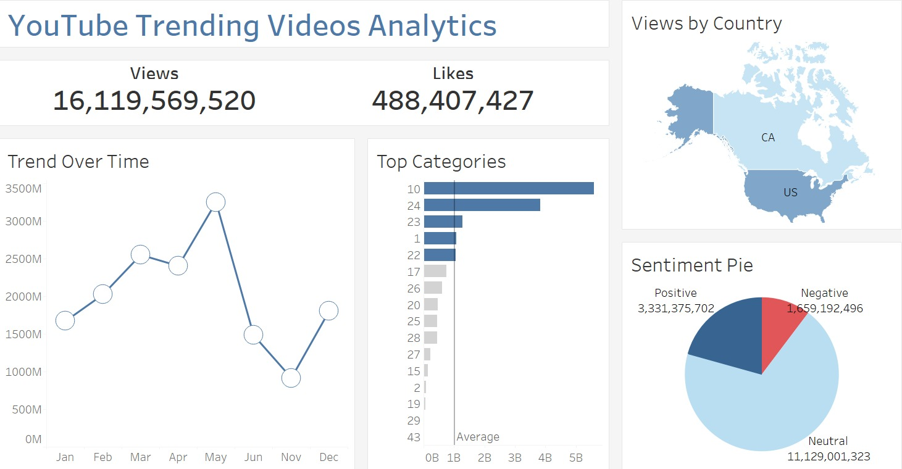

# 📊 YouTube Trending Videos Analytics

An Exploratory Data Analysis (EDA) project on YouTube Trending Videos using **Python** and **Tableau** to analyze video performance, engagement, category trends, sentiment, and country-wise views.

## 📌 Features
- Data Cleaning & Preprocessing
- Exploratory Data Analysis (EDA)
- Sentiment Analysis (Positive, Neutral, Negative)
- Monthly Trend Analysis
- Top Categories Analysis
- Country-wise Views
- Interactive Tableau Dashboard

## 🛠️ Tech Stack
- Python
- Pandas
- NumPy
- Matplotlib
- Seaborn
- TextBlob
- Tableau
- Jupyter Notebook

## 📊 Dashboard



## 📂 Dataset

The original CSV dataset is **larger than 25 MB**, so GitHub does not allow it to be uploaded directly. You can download it from the link below:

**Dataset:**  
`https://drive.google.com/file/d/1_SJTPPJoheuRYCJ_k41ZcQqTRaPKgWSq/view?usp=drive_link`

## 🚀 How to Run

```bash
git clone https://github.com/your-username/YouTube-Trending-Analytics.git
cd YouTube-Trending-Analytics
pip install pandas numpy matplotlib seaborn textblob
jupyter notebook EDA_Project1.ipynb
```

## 👨‍💻 Author

**Santosh Kothapu**

If you found this project helpful, don't forget to ⭐ the repository.
